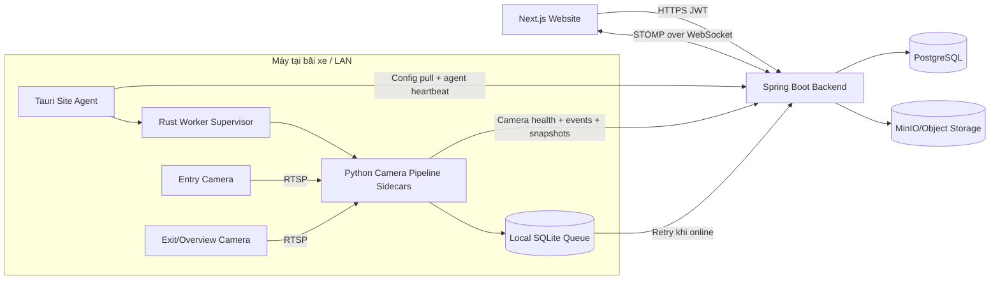

# Kế hoạch triển khai Tauri Parking Site Agent

> Trạng thái: Draft để review kiến trúc  
> Phạm vi: Website + Spring Boot backend + Tauri desktop + Python camera pipeline  
> Mục tiêu chính: tenant chỉ cấu hình camera trên website; desktop app tự đồng bộ, mở RTSP, xử lý camera và gửi trạng thái/event về backend.

## 1. Bối cảnh và vấn đề hiện tại

Hệ thống hiện có các thành phần nền tảng sau:

- Website Next.js cho phép tenant tạo camera, gán site/zone, chọn vai trò `ANPR_GATE` hoặc `OVERVIEW` và nhập RTSP URL.
- Backend Spring Boot lưu camera, cấp camera credential, nhận heartbeat tại `POST /api/cameras/{id}/heartbeat` và nhận parking event tại `POST /api/v1/parking-events`.
- Python edge pipeline có khả năng mở RTSP, reconnect, chạy detection/OCR/tracking, lưu queue offline và gửi event về backend.
- Backend và frontend đã có STOMP/WebSocket để phát dữ liệu realtime.

Tuy nhiên, runtime camera hiện yêu cầu kỹ thuật viên tự tạo JSON profile, lấy camera ID/key và chạy `run_camera_pipeline.py --run-camera`. Flow này không phù hợp với sản phẩm multi-tenant vì tenant không nên biết hoặc thao tác với:

- `camera_id` nội bộ;
- `X-Camera-Key`;
- file cấu hình edge;
- command Python;
- cách restart worker khi RTSP hoặc cấu hình thay đổi.

Ngoài ra, heartbeat hiện tại bắt đầu theo vòng đời process. Nó chưa chứng minh camera đang nhận được frame thật. Vì vậy cần tách health của desktop agent khỏi health của từng camera stream.

## 2. Mục tiêu sản phẩm

### 2.1 Mục tiêu bắt buộc

1. Tenant cấu hình site, gate, camera, Entry/Exit và RTSP hoàn toàn trên website.
2. Desktop app đăng nhập/pair một lần với site và tự hoạt động sau khi Windows khởi động.
3. App chỉ lấy camera thuộc tenant/site đã được cấp quyền.
4. App tự tạo, cập nhật, dừng và restart camera worker theo cấu hình backend.
5. App hiển thị preview Entry/Exit giống màn hình vận hành bãi xe.
6. Backend nhận riêng:
   - agent heartbeat;
   - camera stream health;
   - parking event/OCR/snapshot.
7. Website nhận trạng thái realtime qua backend, không kết nối trực tiếp tới app desktop.
8. Mất Internet không làm dừng camera local; event được queue và gửi lại khi kết nối phục hồi.
9. RTSP credential và device token không xuất hiện trong log hoặc API response dành cho website sau khi lưu.
10. Có installer, auto-start, tray, crash recovery và quy trình revoke thiết bị.

### 2.2 Không thuộc MVP

- Xem raw RTSP trực tiếp từ browser ngoài site.
- Điều khiển desktop app bằng kết nối inbound từ Internet.
- Viết lại toàn bộ AI/OCR pipeline bằng Rust.
- Điều phối hàng nghìn camera trong một desktop instance.
- Cloud transcoding video liên tục.
- Remote desktop hoặc hỗ trợ kỹ thuật điều khiển máy tenant.

## 3. Nguyên tắc kiến trúc

1. **Website là nguồn cấu hình duy nhất:** không duy trì một bản JSON thủ công độc lập tại site.
2. **Outbound-only:** app chỉ mở HTTPS/WebSocket outbound tới backend; không yêu cầu port-forward tại bãi xe.
3. **Site-scoped:** mọi token, API và topic phải bị giới hạn bởi tenant/site.
4. **Agent và camera là hai resource khác nhau:** agent online không đồng nghĩa camera online.
5. **Camera online dựa trên frame:** chỉ online khi nhận được frame hợp lệ trong thời gian timeout.
6. **Desired state reconciliation:** backend cung cấp desired state; app liên tục reconcile runtime state.
7. **At-least-once event delivery:** event có idempotency key và queue offline.
8. **Không lưu raw secret trong database nếu không cần:** token lưu dạng hash; RTSP password dùng envelope encryption.
9. **Tận dụng code hiện có:** giai đoạn đầu Tauri quản lý Python pipeline dưới dạng sidecar.
10. **Mọi thay đổi schema tạo Flyway migration mới:** không sửa migration đã apply.

## 4. Kiến trúc mục tiêu



### 4.1 Ranh giới trách nhiệm

| Thành phần | Trách nhiệm |
|---|---|
| Website | CRUD camera/site/gate, tạo mã pair, theo dõi trạng thái, revoke agent |
| Backend | Authorization, desired config, secret delivery, device identity, health state, event ingest, realtime fan-out |
| Tauri UI | Login/pairing, chọn site, preview Entry/Exit, diagnostics, tray/settings |
| Rust core | Token storage, config sync, process supervision, auto-start, update, health aggregation |
| Python sidecar | RTSP decode, AI/OCR/tracking, snapshot, local event queue, camera health |
| PostgreSQL | Durable desired state, agent/camera health, audit log |
| MinIO | Snapshot/artifact storage |

## 5. Trải nghiệm người dùng

### 5.1 Tenant cấu hình trên website

1. Tenant tạo hoặc chọn site.
2. Tenant tạo gate/panel Entry hoặc Exit nếu cần.
3. Tenant thêm camera:
   - tên;
   - role;
   - panel type Entry/Exit;
   - zone/gate;
   - RTSP URL hoặc host/port/path/username/password tách biệt;
   - trạng thái mong muốn `enabled`/`disabled`.
4. Backend validate format nhưng không kết luận online từ browser.
5. Website hiển thị `Chờ Site Agent` nếu chưa có agent active.
6. Khi agent sync và mở được stream, trạng thái lần lượt chuyển:
   - `ASSIGNED`;
   - `CONNECTING`;
   - `STREAMING`;
   - `ONLINE`.
7. Khi lỗi, website hiển thị error code có thể hành động, không hiển thị password.

### 5.2 Pair desktop app

Flow khuyến nghị cho MVP:

1. Admin vào website, chọn site và bấm **Thêm máy vận hành**.
2. Backend tạo enrollment code ngắn hạn, dùng một lần, hết hạn sau 10 phút.
3. Nhân viên mở Tauri app và đăng nhập.
4. App nhập/scan enrollment code hoặc chọn site được phép.
5. Backend kiểm tra tenant, role và enrollment code.
6. Backend tạo `site_agent`, cấp access token ngắn hạn và refresh/device credential dài hạn.
7. Rust core lưu credential trong Windows Credential Manager.
8. Từ lần chạy sau app dùng device credential, không lưu password người dùng.

### 5.3 Vận hành hằng ngày

- App tự chạy cùng Windows và thu nhỏ xuống system tray.
- Dashboard local hiển thị agent connection, camera Entry/Exit, FPS, last frame và queue depth.
- Mỗi camera có nút reconnect và xem lỗi; tenant không phải chỉnh file.
- Khi website thay đổi RTSP, app nhận config version mới và rolling restart đúng worker bị ảnh hưởng.
- Khi agent mất backend, camera vẫn chạy local và event được queue.
- Khi backend phục hồi, app flush queue theo thứ tự và idempotency key.

## 6. Mô hình domain và trạng thái

### 6.1 Bảng `site_agent`

Tạo migration Flyway mới, ví dụ version kế tiếp tại thời điểm triển khai.

Các trường đề xuất:

| Trường | Kiểu | Ý nghĩa |
|---|---|---|
| `id` | UUID | Agent identity |
| `tenant_id` | UUID | Tenant scope |
| `site_id` | UUID | Site được bind |
| `name` | varchar | Tên máy hiển thị |
| `device_fingerprint_hash` | varchar | Phát hiện duplicate, không lưu raw fingerprint |
| `status` | enum/varchar | provisioning/online/offline/revoked |
| `version` | varchar | Phiên bản desktop app |
| `platform` | varchar | Windows version/architecture |
| `last_heartbeat_at` | timestamp | Agent liveness |
| `last_ip` | inet/varchar | Diagnostics/audit |
| `capabilities_json` | jsonb | CPU/GPU/model/runtime capabilities |
| `created_at` | timestamp | Audit |
| `updated_at` | timestamp | Audit |
| `revoked_at` | timestamp nullable | Revoke lifecycle |

### 6.2 Bảng `site_agent_credential`

| Trường | Ý nghĩa |
|---|---|
| `agent_id` | FK đến `site_agent` |
| `token_hash` | Hash của device refresh token |
| `expires_at` | Hạn dùng |
| `last_used_at` | Theo dõi sử dụng |
| `rotated_at` | Rotation audit |
| `revoked_at` | Thu hồi credential |

Không lưu plaintext refresh token.

### 6.3 Bảng/field camera cần bổ sung

Không dùng `Camera.status` hiện tại để chứa mọi trạng thái chi tiết. Có thể thêm `camera_runtime_health` để giữ runtime state tách khỏi desired configuration.

| Trường | Ý nghĩa |
|---|---|
| `camera_id` | Camera |
| `agent_id` | Agent đang sở hữu runtime |
| `connection_state` | assigned/connecting/streaming/error/stopped |
| `last_heartbeat_at` | Health report mới nhất |
| `last_frame_at` | Frame hợp lệ mới nhất |
| `fps` | FPS quan sát được |
| `width`, `height` | Độ phân giải stream |
| `codec` | H264/H265/... |
| `reconnect_count` | Số lần reconnect |
| `queue_depth` | Event đang chờ gửi |
| `error_code` | Mã lỗi ổn định |
| `error_message_safe` | Thông báo đã loại secret |
| `config_version` | Version app đã apply |
| `updated_at` | Audit |

### 6.4 Agent state machine

```text
UNPAIRED -> ENROLLING -> ONLINE -> OFFLINE
                         |          |
                         +-------> REVOKED
```

Quy tắc:

- `ONLINE`: heartbeat agent còn mới hơn timeout.
- `OFFLINE`: quá timeout nhưng credential chưa bị revoke.
- `REVOKED`: backend từ chối refresh/config/event ngay lập tức.
- Scheduled sweep của backend cập nhật offline tương tự camera sweep hiện có.

### 6.5 Camera runtime state machine

```text
UNASSIGNED -> ASSIGNED -> CONNECTING -> STREAMING -> ONLINE
                              |            |          |
                              +----------> ERROR <----+
                                           |
                                      RECONNECTING

Mọi state -> DISABLED khi desired state bị tắt.
Mọi state -> AGENT_OFFLINE khi agent quá heartbeat timeout.
```

Điều kiện `ONLINE`:

- agent online;
- worker đang chạy;
- có frame hợp lệ trong `camera.frame-timeout-seconds`;
- config version đã apply bằng desired version.

Không đánh dấu online chỉ vì POST heartbeat trả 200.

## 7. API contract đề xuất

Tất cả endpoint agent dùng namespace riêng để không nhầm với operator JWT.

### 7.1 Operator API trên website

#### `POST /api/sites/{siteId}/agents/enrollment-codes`

Tạo code pair dùng một lần. Yêu cầu manager/admin của site.

Response:

```json
{
  "code": "ABCD-EFGH",
  "expiresAt": "2026-07-21T10:10:00Z"
}
```

#### `GET /api/sites/{siteId}/agents`

Liệt kê agent, version, last heartbeat, camera count và health summary.

#### `POST /api/site-agents/{agentId}/revoke`

Revoke credential, dừng config sync và phát audit event.

#### `POST /api/site-agents/{agentId}/rotate-credential`

Rotation có grace window để tránh downtime.

### 7.2 Enrollment và authentication API

#### `POST /api/agent/enroll`

Input:

```json
{
  "enrollmentCode": "ABCD-EFGH",
  "name": "May Entry-Exit 01",
  "deviceFingerprint": "sha256:...",
  "version": "0.1.0",
  "platform": "windows-x86_64"
}
```

Response trả access token ngắn hạn và device refresh token đúng một lần. Không dùng camera key làm agent credential.

#### `POST /api/agent/token/refresh`

Rotation refresh token và trả access token mới. Có reuse detection.

### 7.3 Config sync API

#### `GET /api/agent/config?sinceVersion={version}`

Response `304` nếu không đổi hoặc trả desired state:

```json
{
  "version": 42,
  "siteId": "uuid",
  "generatedAt": "2026-07-21T10:00:00Z",
  "cameras": [
    {
      "id": "uuid",
      "name": "CAM1",
      "role": "ANPR_GATE",
      "panelType": "entry",
      "enabled": true,
      "source": {
        "type": "rtsp",
        "url": "rtsp://192.168.0.121:554/ch1/main",
        "username": "admin",
        "passwordSecret": {
          "ciphertext": "agent-scoped-envelope"
        }
      },
      "pipelineProfile": "lpr-default-v1",
      "revision": 7
    }
  ]
}
```

Yêu cầu:

- Secret chỉ trả cho agent bind đúng site.
- Response đặt `Cache-Control: no-store`.
- Không log response body.
- Mỗi camera có revision để restart chọn lọc.
- MVP có thể long-poll/poll 15 giây; sau đó bổ sung config-changed WebSocket signal.

### 7.4 Agent heartbeat

#### `POST /api/agent/heartbeat`

```json
{
  "version": "0.1.0",
  "startedAt": "2026-07-21T09:00:00Z",
  "configVersion": 42,
  "cpuPercent": 21.3,
  "memoryMb": 812,
  "queueDepth": 3,
  "workers": 2
}
```

Không gộp camera stream state vào endpoint này.

### 7.5 Camera health

#### `POST /api/agent/cameras/{cameraId}/health`

```json
{
  "state": "STREAMING",
  "observedAt": "2026-07-21T10:00:10Z",
  "lastFrameAt": "2026-07-21T10:00:09.800Z",
  "fps": 15.0,
  "width": 1920,
  "height": 1080,
  "codec": "h264",
  "reconnectCount": 1,
  "queueDepth": 0,
  "configRevision": 7,
  "error": null
}
```

Backend xác thực:

- agent thuộc cùng tenant/site;
- camera nằm trong desired config của agent;
- timestamp không vượt clock-skew cho phép;
- payload có size/rate limit;
- không tin status do client gửi để bypass authorization.

### 7.6 Parking event ingest

Tiếp tục sử dụng `POST /api/v1/parking-events` và contract/event version hiện có. Thay đổi authentication từ camera key thủ công sang một trong hai hướng:

1. **MVP:** backend tự cấp camera-scoped token cho agent trong config envelope;
2. **Khuyến nghị dài hạn:** agent access token + camera ID, backend kiểm tra assignment.

Giữ event ID/idempotency để retry không tạo dữ liệu trùng.

## 8. Realtime từ backend tới website

Tái sử dụng STOMP/WebSocket hiện có nhưng thêm topic tenant/site scoped:

```text
/topic/site/{siteId}/agents
/topic/site/{siteId}/cameras
/topic/site/{siteId}/parking-events
```

Event camera health đề xuất:

```json
{
  "type": "camera.health.changed",
  "siteId": "uuid",
  "cameraId": "uuid",
  "agentId": "uuid",
  "status": "online",
  "connectionState": "STREAMING",
  "lastFrameAt": "2026-07-21T10:00:09.800Z",
  "occurredAt": "2026-07-21T10:00:10Z",
  "version": 1
}
```

Authorization interceptor phải từ chối subscribe topic của tenant/site khác. Không tiếp tục dùng global topic cho dữ liệu agent/camera mới.

Website vẫn phải fetch snapshot hiện tại qua REST khi load/reconnect; WebSocket chỉ dùng cho delta, không phải source of truth.

## 9. Thiết kế Tauri desktop app

### 9.1 Cấu trúc thư mục đề xuất

```text
desktop/
├── package.json
├── src/                         # React/Tauri UI
│   ├── app/
│   ├── components/
│   ├── features/auth/
│   ├── features/cameras/
│   ├── features/diagnostics/
│   └── lib/api/
├── src-tauri/
│   ├── Cargo.toml
│   ├── tauri.conf.json
│   ├── capabilities/
│   └── src/
│       ├── auth.rs
│       ├── config_sync.rs
│       ├── credential_store.rs
│       ├── supervisor.rs
│       ├── health.rs
│       ├── updater.rs
│       └── main.rs
└── sidecars/
    ├── camera-edge.exe
    ├── ffmpeg.exe
    └── models/
```

### 9.2 Rust worker supervisor

Supervisor duy trì map `cameraId -> WorkerHandle` và chạy reconciliation:

1. Pull desired config.
2. So sánh camera revision với applied revision.
3. Camera mới/enabled: tạo runtime config trong memory hoặc file tạm có ACL hạn chế rồi start worker.
4. Camera đổi source/profile: start replacement worker, xác nhận frame rồi stop worker cũ nếu tài nguyên cho phép.
5. Camera disabled/deleted: graceful stop, flush queue, cleanup secret/temp file.
6. Worker crash: exponential backoff có jitter và crash-loop circuit breaker.
7. Gửi runtime state lên backend.

Không truyền RTSP password qua command line vì command line có thể bị process inspection đọc. Dùng stdin, named pipe hoặc file tạm ACL riêng rồi xóa.

### 9.3 Python sidecar

Giai đoạn đầu đóng gói pipeline hiện có thành executable/sidecar và bổ sung IPC contract:

Input control:

```json
{"type":"start","cameraConfig":{}}
{"type":"stop"}
{"type":"reconnect"}
```

Output stdout JSON Lines, không chứa secret:

```json
{"type":"stream.connected","cameraId":"uuid","width":1920,"height":1080,"fps":15}
{"type":"frame.observed","cameraId":"uuid","at":"..."}
{"type":"stream.error","cameraId":"uuid","code":"RTSP_AUTH_FAILED"}
{"type":"queue.depth","cameraId":"uuid","value":4}
```

Chuẩn hóa error code:

- `RTSP_DNS_FAILED`
- `RTSP_CONNECT_TIMEOUT`
- `RTSP_CONNECTION_REFUSED`
- `RTSP_AUTH_FAILED`
- `RTSP_UNSUPPORTED_CODEC`
- `RTSP_NO_FRAMES`
- `MODEL_LOAD_FAILED`
- `INGEST_UNAUTHORIZED`
- `BACKEND_UNREACHABLE`
- `WORKER_CRASHED`

### 9.4 Preview Entry/Exit

Không đưa RTSP URL/password vào WebView. Lựa chọn MVP:

- Python/Rust decode frame;
- giảm preview xuống 5-10 FPS và kích thước phù hợp;
- truyền JPEG/WebP frame qua Tauri event hoặc local loopback endpoint có random session token;
- UI render card Entry/Exit và overlay plate/bounding box.

Đánh giá hiệu năng trước khi chọn transport cuối cùng. Nếu Tauri event gây copy/memory pressure, dùng shared memory hoặc local WebRTC/MJPEG server chỉ bind `127.0.0.1`.

## 10. Security plan

### 10.1 Authentication và authorization

- User login chỉ dùng để enrollment, không giữ password.
- Device credential tách khỏi operator JWT.
- Access token ngắn hạn; refresh token rotate mỗi lần dùng.
- Device token bind tenant/site/agent và có audience riêng.
- Revoke agent làm invalid token ngay, không chờ expiry dài.
- Backend kiểm tra assignment trên mọi camera health/event request.

### 10.2 Secret handling

- RTSP password mã hóa tại rest bằng application KMS/master key.
- Chỉ decrypt khi tạo agent-scoped config response.
- Không trả RTSP password qua camera CRUD/list API thông thường.
- Không log Authorization, enrollment code, device token, camera key hoặc URL có userinfo.
- Redact URL thành `rtsp://***@host:port/path`.
- Windows lưu device credential trong Credential Manager/DPAPI-backed storage.
- File queue/snapshot local có ACL chỉ cho user/service chạy app.

### 10.3 Network

- HTTPS/WSS bắt buộc ngoài môi trường dev.
- App không listen trên `0.0.0.0`.
- Local preview server, nếu có, chỉ bind `127.0.0.1` và dùng ephemeral token.
- Config/event APIs có rate limit và request size limit.
- WebSocket topic phải site-scoped và được authorize khi subscribe.

### 10.4 Supply chain và update

- Ký Windows installer và update artifact.
- Update manifest có signature/hash.
- Pin version sidecar/model tương thích với app version.
- Có staged rollout/canary và rollback.

## 11. Reliability và offline behavior

### 11.1 Config sync

- Poll mặc định 15 giây với ETag/config version.
- WebSocket config-changed signal chỉ để wake-up; REST vẫn lấy canonical config.
- Giữ last-known-good config mã hóa local.
- Config mới chỉ commit applied version sau khi validate.
- Nếu config mới lỗi, giữ worker cũ khi an toàn và report `CONFIG_REJECTED`.

### 11.2 Heartbeat timeout đề xuất

| Tín hiệu | Chu kỳ | Offline timeout |
|---|---:|---:|
| Agent heartbeat | 20 giây | 60-90 giây |
| Camera health | 10 giây | 30-45 giây |
| Last frame | cập nhật nội bộ liên tục | 10-20 giây tùy camera |

Giá trị phải cấu hình được và có jitter để tránh thundering herd.

### 11.3 Offline event queue

- Tái sử dụng SQLite queue hiện có.
- Giới hạn theo số event và dung lượng byte.
- Ưu tiên metadata; snapshot có retention/quota riêng.
- Retry exponential backoff + jitter.
- `4xx` không retry trừ `408/409/429` theo contract.
- `401/403` trigger token refresh/config resync trước khi discard.
- Event thành công chỉ xóa sau response durable từ backend.

## 12. Thay đổi theo repository

### 12.1 Backend

Thêm package dự kiến:

```text
backend/src/main/java/com/vehiclemanagement/agent/
├── SiteAgent.java
├── SiteAgentCredential.java
├── CameraRuntimeHealth.java
├── SiteAgentController.java
├── AgentRuntimeController.java
├── AgentEnrollmentService.java
├── AgentConfigService.java
├── AgentHealthService.java
├── AgentAuthenticationFilter.java
└── AgentRealtimePublisher.java
```

Cập nhật:

- Security filter chain cho agent token audience.
- Camera service để tách desired status và runtime health.
- WebSocket authorization/topics.
- Audit log cho enroll/revoke/rotate/config delivery.
- Scheduled sweep cho agent/camera health.
- Camera create/update tăng config version của site.

### 12.2 Frontend website

Thêm:

- `/parking/agents`: danh sách máy tại site, pair code, revoke, version/health.
- Camera form hỗ trợ password write-only và test status.
- Camera status component với state/error rõ ràng.
- Site agent banner trên `/parking/cameras` và `/parking/commissioning`.
- Subscribe `/topic/site/{siteId}/cameras` và merge delta vào REST state.
- Không hiển thị hoặc cache RTSP password sau submit.

### 12.3 Desktop

Tạo workspace `desktop/` độc lập nhưng dùng chung TypeScript API contracts nếu khả thi.

### 12.4 Edge pipeline

Cập nhật:

- phát stream/frame health qua IPC;
- không start camera-online heartbeat trước frame;
- nhận config động an toàn;
- standardized error codes;
- graceful shutdown/flush;
- redact secret trong exception/log;
- đóng gói sidecar reproducible.

## 13. Kế hoạch triển khai theo phase

### Phase 0 - Architecture spike và contract freeze

Mục tiêu: loại bỏ rủi ro kỹ thuật lớn trước khi phát triển đầy đủ.

- [ ] Tạo Tauri hello-world trên Windows.
- [ ] Spawn Python sidecar và đọc JSON Lines.
- [ ] Mở camera RTSP thực tế trong sidecar.
- [ ] Hiển thị preview Entry/Exit trong Tauri.
- [ ] Đo CPU, RAM, latency và reconnect.
- [ ] Chọn preview transport.
- [ ] Chốt API/error/state contracts.

Exit criteria:

- Preview 1080p/15 FPS source chạy ổn định tối thiểu 2 giờ.
- App restart sidecar sau crash.
- Secret không xuất hiện trong process command line/log.

### Phase 1 - Backend agent foundation

- [ ] Migration mới cho agent, credential, runtime health và config version.
- [ ] Enrollment code API.
- [ ] Agent token issuance/refresh/revoke.
- [ ] Site-scoped config API.
- [ ] Agent heartbeat và scheduled offline sweep.
- [ ] Camera health API dựa trên `lastFrameAt`.
- [ ] Audit/security tests.

Exit criteria:

- Agent tenant A không thể đọc site/camera tenant B.
- Revoke có hiệu lực tức thì.
- Camera không có frame bị offline dù agent vẫn online.

### Phase 2 - Tauri pairing và config sync

- [ ] Login/enrollment UI.
- [ ] Secure device credential storage.
- [ ] Auto refresh token.
- [ ] Pull desired config bằng version/ETag.
- [ ] Last-known-good config.
- [ ] System tray và auto-start.
- [ ] Agent diagnostics screen.

Exit criteria:

- Pair một lần, reboot Windows, app tự online lại không cần password.
- Website sửa camera và app nhận config trong SLA.

### Phase 3 - Worker orchestration và preview

- [ ] Rust supervisor reconciliation.
- [ ] Python sidecar packaging.
- [ ] Entry/Exit worker lifecycle.
- [ ] Preview UI và overlay.
- [ ] Camera health/last-frame reporting.
- [ ] Reconnect/backoff/circuit breaker.
- [ ] Resource limits cho nhiều camera.

Exit criteria:

- Add/update/disable camera trên web không cần thao tác file/app.
- Sai password RTSP hiển thị `RTSP_AUTH_FAILED` trên cả app và website.
- Khôi phục camera tự động sau network interruption.

### Phase 4 - Event ingest, offline queue và realtime website

- [ ] Agent-scoped ingest authentication.
- [ ] Event idempotency/replay tests.
- [ ] Snapshot upload và quota.
- [ ] Realtime camera/agent topics.
- [ ] Website agent management page.
- [ ] Cập nhật `/parking/cameras` và `/parking/commissioning`.

Exit criteria:

- Mất Internet 30 phút, camera tiếp tục xử lý; event được sync lại không trùng.
- Website cập nhật camera health trong SLA sau heartbeat.

### Phase 5 - Production hardening và distribution

- [ ] Signed Windows installer.
- [ ] Auto-update signed artifacts.
- [ ] Structured logs + local support bundle đã redact.
- [ ] Metrics và alert agent offline/camera offline.
- [ ] Load/soak test 24-72 giờ.
- [ ] Canary rollout và rollback runbook.
- [ ] Tài liệu vận hành cho tenant/support.

Exit criteria:

- Không memory leak đáng kể trong soak test.
- Auto-update rollback được xác minh.
- Installer/uninstaller không làm mất event queue ngoài ý muốn.

## 14. Test strategy

### 14.1 Backend tests

- Unit test enrollment expiry, one-time use, token rotation/reuse/revoke.
- Controller test authorization và tenant/site isolation.
- Integration test config version tăng khi camera đổi.
- Integration test agent online/offline sweep.
- Integration test camera online chỉ khi `lastFrameAt` fresh.
- WebSocket authorization test cross-tenant subscribe.
- Event idempotency và billing/quota regression tests.
- Bắt buộc chạy `mvn clean install` sau mọi thay đổi backend.
- Bắt buộc boot sạch bằng `mvn spring-boot:run` và dừng process sau xác minh.

### 14.2 Rust/Tauri tests

- Unit test reconciliation add/update/remove/no-op.
- Token refresh/revoke recovery.
- Worker crash-loop/backoff.
- Config rollback/last-known-good.
- Secure store abstraction với fake store trong CI.
- IPC malformed/oversized message handling.

### 14.3 Python edge tests

- RTSP connect, auth fail, timeout, no-frame, reconnect.
- Frame health event không phát trước frame thật.
- Secret redaction.
- Offline queue cap/retry/idempotency.
- Graceful shutdown flush.

### 14.4 E2E

Kịch bản tối thiểu:

1. Admin tạo site, camera Entry/Exit và enrollment code.
2. Tauri pair đúng site.
3. App tải camera và preview có hình.
4. Website chuyển camera sang online.
5. Đổi RTSP password sai: app và web báo auth failed.
6. Sửa lại password: tự reconnect, không restart app.
7. Rút mạng Internet: camera vẫn chạy, event vào queue.
8. Cắm mạng lại: queue về 0, không duplicate event.
9. Revoke agent: config/event request bị từ chối và app về màn hình pairing.
10. Tenant khác không nhìn thấy agent/camera/topic.

### 14.5 Performance/soak

- Test 2, 4, 8 camera tùy target hardware.
- Đo CPU/GPU/RAM, preview latency, inference latency và queue throughput.
- Soak 24-72 giờ với RTSP disconnect định kỳ.
- Xác minh log rotation và disk quota.

## 15. Observability và supportability

Structured log fields chung:

```text
service, version, agent_id, tenant_id, site_id, camera_id,
config_version, stage, status, error_code, correlation_id, timestamp
```

Tuyệt đối không log:

- RTSP URL có userinfo;
- RTSP password;
- access/refresh token;
- enrollment code;
- camera key;
- raw ảnh nếu chưa có chính sách retention.

Metrics tối thiểu:

- `agent_heartbeat_age_seconds`;
- `camera_last_frame_age_seconds`;
- `camera_reconnect_total`;
- `camera_worker_restart_total`;
- `event_queue_depth`;
- `event_delivery_failures_total`;
- `inference_duration_ms`;
- CPU/RAM/GPU/disk free.

Support bundle do user chủ động export, gồm version, safe config metadata, log đã redact, metrics snapshot và không chứa credential.

## 16. Deployment và rollout

### 16.1 Môi trường dev

- Backend/frontend/PostgreSQL/MinIO tiếp tục chạy Docker Compose.
- Tauri chạy native trên Windows để truy cập camera LAN.
- Sidecar build local và được Tauri quản lý.
- Dùng camera test thật hoặc RTSP simulator cho CI/dev không có camera.

### 16.2 Pilot

1. Chọn một site, một máy Windows và hai camera Entry/Exit.
2. Chạy canary ít nhất một tuần.
3. Theo dõi reconnect, false offline, event loss/duplicate và disk usage.
4. Freeze schema/API v1 sau pilot.
5. Mở rộng theo từng site, có rollback installer trước đó.

### 16.3 Compatibility

- Backend config response có `contractVersion`.
- App gửi version/capabilities trong heartbeat.
- Backend chỉ phát field/profile app hỗ trợ.
- Có minimum-supported-version và grace period khi bắt buộc update.

## 17. Rủi ro và biện pháp

| Rủi ro | Tác động | Giảm thiểu |
|---|---|---|
| RTSP LAN không ổn định | False offline/event loss | Reconnect, jitter, last-frame health, local queue |
| Python sidecar quá nặng | Máy vận hành chậm | Benchmark, giới hạn camera, hardware profile, GPU capability |
| Secret rò qua log/CLI | Nghiêm trọng | Secure store, stdin/pipe, redaction tests |
| App chạy dưới user bị logout | Mất vận hành | Auto-start; đánh giá Windows Service companion cho production |
| Auto-update lỗi | Toàn site downtime | Signed update, staged rollout, rollback |
| WebSocket mất event | UI stale | REST snapshot khi reconnect, WS chỉ delta |
| Duplicate offline replay | Sai nghiệp vụ | Event ID/idempotency transaction |
| Một agent chiếm camera của agent khác | Hai pipeline trùng | Assignment lease/fencing token |
| Clock máy site sai | Health/event ordering sai | Server-observed timestamp, clock skew detection |
| H265/OpenCV codec mismatch | Không có frame | FFmpeg/GStreamer fallback và capability reporting |

## 18. Quyết định cần chốt trước Phase 1

1. Một site chỉ có một active agent hay cho phép primary/standby?
2. App chạy theo user session hay có Windows Service companion?
3. Preview transport: Tauri event JPEG, loopback MJPEG/WebRTC hay shared memory?
4. Secret encryption dùng KMS/Vault hay application master key ở giai đoạn đầu?
5. Agent ingest dùng agent token hay backend tiếp tục cấp camera-scoped key tự động?
6. Hardware profile tối thiểu và số camera tối đa trên một máy?
7. Cơ chế auto-update và code-signing certificate?
8. Retention/quota cho event queue và snapshot offline?

Khuyến nghị ban đầu:

- MVP cho phép một active agent/site; thiết kế lease để mở rộng standby sau.
- Tauri UI + Rust supervisor; đánh giá Service companion trước production rollout.
- Tái sử dụng Python sidecar và SQLite queue.
- Agent token cho control plane; camera-scoped token tự động cho event ingest trong MVP.
- REST config pull có version + WebSocket wake-up signal.
- Camera online dựa trên server-observed health và `lastFrameAt`.

## 19. Definition of Done toàn dự án

Chỉ coi feature hoàn thành khi:

- Tenant tạo/sửa/xóa RTSP trên website mà không chỉnh file local.
- Desktop pair một lần và tự chạy sau reboot.
- Camera Entry/Exit tự xuất hiện và preview được trong app.
- Website hiển thị agent/camera health realtime đúng tenant/site.
- Camera online chỉ khi có frame thật.
- RTSP lỗi có error code rõ ràng và tự phục hồi khi sửa config.
- Offline queue replay không mất/duplicate event.
- Revoke agent hoạt động ngay.
- Không có secret trong log, command line, browser storage hoặc camera list API.
- Backend build/test và boot verification đều xanh theo `AGENTS.md`.
- Frontend, Rust, Python unit/integration/E2E và soak test đạt tiêu chí phase.
- Installer/update ký số, có rollback và tài liệu vận hành.

## 20. Thứ tự implementation khuyến nghị

```text
Contract/state model
    -> Backend enrollment + agent auth
    -> Config sync + health APIs
    -> Tauri secure pairing
    -> Rust supervisor + Python IPC
    -> RTSP preview + last-frame health
    -> Event ingest/offline replay
    -> Website realtime/status UX
    -> Installer/update/production hardening
```

Thứ tự này tạo một vertical slice sớm: cấu hình camera trên website, pair app, tải config, mở một RTSP thật và phản hồi trạng thái online dựa trên frame. Các tính năng AI/OCR nâng cao tiếp tục tái sử dụng và hoàn thiện sau khi control plane ổn định.
